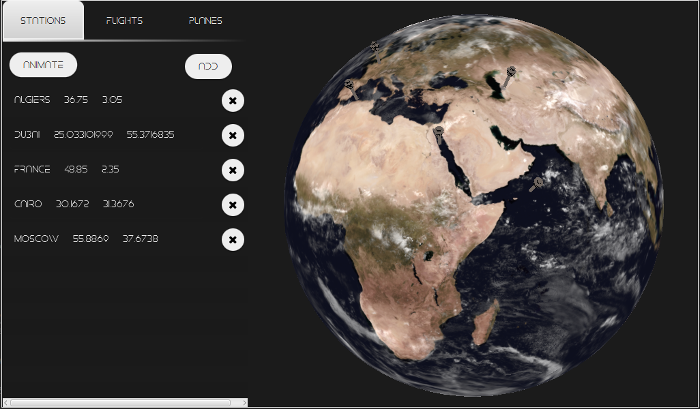
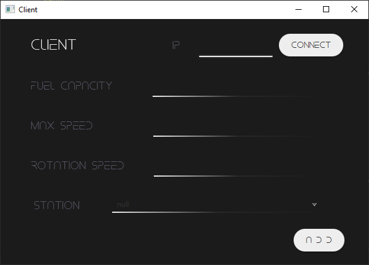

# Multiclient App for Tracking Flights

A Java and JavaFX based application that provides a simulation of real-time tracking of flights and their corresponding planes and stations.

## Screenshots

Server Side

Client Side

## Features

- Real-time tracking of flights, planes and stations
- CRUD functionalities for stations, flights, and planes
- RMI communication between clients and the server
- Representation of the server as a global control tower with access to all available stations, flights and planes
- Representation of clients as plane

## Requirements

- Java 8 or above
- JavaFX
- RMI
## Getting Started

1. Start the RMI registry by using the command `start rmiregistry` in the terminal
2. Run the MainApp to start the server
3. Start the clients by running the ClientApplication
